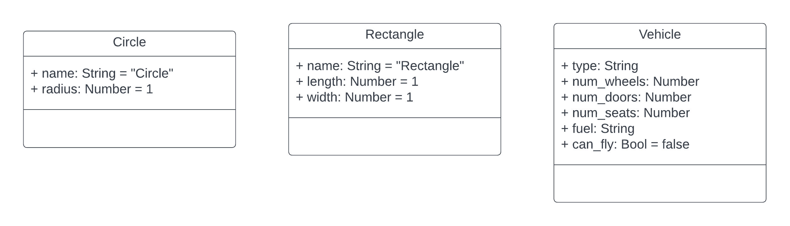

# 2.5 - Classes

###### ICS4U - Mr. Brash 🐿️

- [Jump to the task](#your-task)

# Lesson

Recall the Stack that we created?

It  allowed us to store and retrieve information in that one _custom data structure_. **But what if we needed to use more than one stack?** In this style of code, we would need to copy and paste all of the Stack code and make a Stack2. That's a waste of code.

> Abstract data types as defined in lessons 2.3 and 2.4 _cannot be copied_. They are limited to _one_ implementation per definition.

## Classes
A **[class](https://brilliant.org/wiki/classes-oop/)** is a _blueprint_ for a data structure that _describes an object_. Since it is a _blueprint_, we can generate copies of it (called "instances"). As many instances as we need!

```JS
class Stack {
  // Other code goes here
}
```

As a standard, we give class names a Capital First Letter: `Stack`. Similar to `String`, `Math`, or `Array`.

Just like a house or your shirt have properties, we can give our `Stack` _properties_: contents, name, etc. To an object, they are _descriptors_ or values. To humans, they are _properties_.
```JS
class Stack {
  name = "";
  contents = [];
  max_length = 255;
  // Etc...
}
```

Notice the lack of `let`, `var`, or `const`. More on this later, but essentially the `let` is implied. 

## New

A `class` is just a blueprint. It becomes a real `object` by using the keyword `new`.

`new` says we want to make an **_instance_** of a class. This is called _[instantiation](https://www.techtarget.com/whatis/definition/instantiation)_. We have already seen this when we ask JavaScript for a new array:
```JS
let arr = new Array(10); // get a new array of size 10
```
Guess what? **Arrays are objects!** By using the `new` keyword, we are asking JavaScript to _create_ (or instantiate) an instance of an Array object - in this case of size 10. **That means we can do it with our Stack!**
```JS
class Stack {
  name = "";
  contents = [];
  max_length = 255;
}

let my_stack = new Stack();
let another_stack = new Stack();
```

## Working with Properties

How do we get access to the "name" property in the above examples? Or how do we change it?

Once an object is instantiated you can `get` or `set` the values of object properties using the dot-notation we've seen with things like `String`, `Math`, and `Arrays`:
```JS
let my_stack = new Stack();
my_stack.name = "Pretty little stack";

console.log(my_stack.name);       // 'Pretty little stack'
console.log(my_stack.max_length); // 255
```

###### [Click here for more examples](#more-examples)

If you have any questions at this point, don't hesitate to ask!


## Your Task

- [Back to the lesson](#lesson)

The diagram you see below is called a _class diagram_. More on that later but the basic pattern is:
> property_name: data_type = optional_default_value

If no default value is required:
> property_name: data_type



The first class you are to define is a `Circle`. It has two properties: `name` and `radius`. Both have default values. Notice that the `Vehicle` class only has one property with a default value.

Define those three classes with the given properties. Then test your code and play around making instances of your classes and modifying properties. For example, you could run:
```JS
let rect1 = new Rectangle();
let rect2 = new Rectangle();
rect1.name = "Best Rectangle Ever!";
rect1.length = 10;
rect1.width = 20;
rect2.name = "Square"
rect2.length = 5;
rect2.width = rect2.length;
console.log("The area of", rect1.name,"is:", rect1.length * rect1.width);
console.log("The area of", rect2.name,"is:", rect1.length * rect1.width);
```

---

Use [the Stack example below](#the-stack) to see how you can add _functions_ to your Class declaration.

- In your `Circle` Class declaration, add functions to calculate and _return_ the `area` and `circumference` of the circle. Remember to use `this` and to use `Math.PI` instead of 3.14.

- In your `Rectangle` Class declaration, add functions to calculate and _return_ the `area` and `perimeter` of the rectangle. Also, add the function `is_square` that returns `true` if the rectangle is, in fact, a square and `false` otherwise. Remember to use `this` when necessary.

### Examples:
```JS
let pizza = new Circle();
pizza.name = "Medium Pizza";
pizza.radius = 8;
console.log(pizza.area());

let square = new Rectangle();
square.name = "I'm a square!";
square.length = 123;
square.width = 123;
console.log(square.is_square());
```


---


### More Examples:

- [The Lesson](#lesson)
- [Your Task](#your-task)


Here's an example class that represents a simple car
```JS
class Car {
  make = "";
  model = "";
  year = 0;
  colour = "";
  mileage = 0;
  is_locked = false;

  lock() {
    this.is_locked = true;
  }

  unlock() {
    this.is_locked = false;
  }
}

// Here's an example of instantiating a Car
let my_car = new Car();
my_car.year = 2014;
my_car.colour = "Titanium";
my_car.make = "Mazda";
my_car.model = "Mazda3";
my_car.mileage = 102876;
my_car.lock();

// You can make more than one!
let my_van = new Car();
my_van.year = 2018
my_van.make = "Chrysler"
my_van.model = "Pacifica"
// etc...
```

Notice the use of the keyword `new` to _instantiate_ a copy of the blueprint and generate a variable that holds data!

### The Stack
And now here's a **Stack** class for your reference:
```JS
class Stack {
  name = "";
  contents = [];
  max_length = 255;

  push(data) {
    if (this.contents.length < 254)
      this.contents.push(data);
    else
      return -1;
  }

  pop() {
    if (!this.is_empty()) 
      return this.contents.pop();
    else
      return "The stack is empty";
  }

  peek() {
    if (this.is_empty())
      return "The stack is empty";
    else
      return this.contents[this.contents.length - 1];
  }

  is_empty() {
    return this.contents.length == 0;
  }
}
```